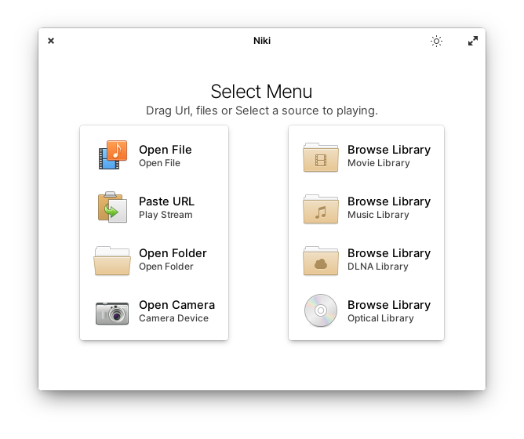
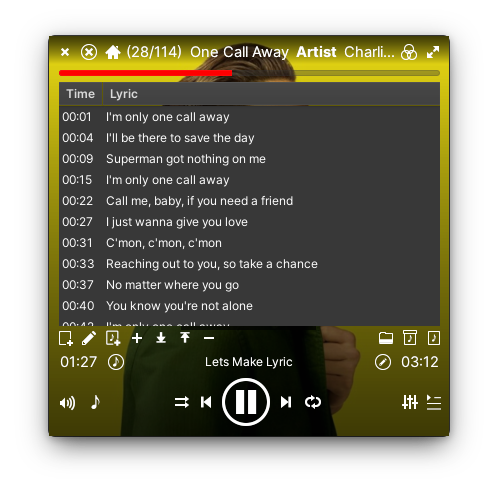
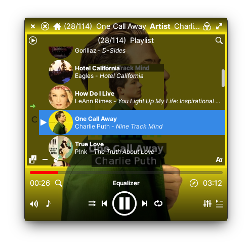
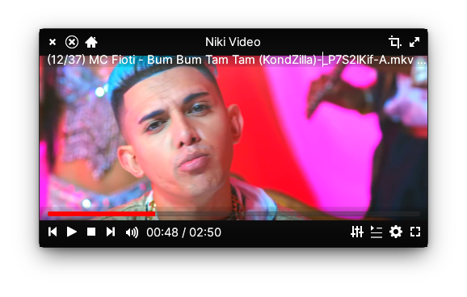

# Media Player DLNA, Music, Video and streaming.
 

## Niki player.

## Building, Testing, and Installation
## You'll need the following dependencies:

* meson
* libgranite-dev
* libgtk-3-dev
* valac
* libsoup2.4-dev 
* libgstreamer-plugins-base1.0-dev 
* libclutter-gtk-1.0-dev 
* libclutter-gst-3.0-dev
* libgirepository1.0-dev
* libtag1-dev
* libtagc0-dev
* libcanberra-dev
* libgstreamer-plugins-good1.0-dev,
* libgstreamer-plugins-bad1.0-dev,
* libgupnp-1.0-dev,
* libgupnp-av-1.0-dev,
* libgssdp-1.0-dev,
* libcairo2-dev,

Run `meson` to configure the build environment and then `ninja` to build and run automated tests

    meson build --prefix=/usr
    cd build
    ninja

To install, use `ninja install`, then execute with `com.github.torikulhabib.niki`

    sudo ninja install

## Support
If you like Niki and you want to support its development,consider supporting via [PayPal](https://paypal.me/TorikulHabib?locale.x=id_ID), [Patreon](https://www.patreon.com/nikiplayer) or  [LiberPay](https://liberapay.com/Torikul_habib)

### Roadmap
#### v0.5
- [x] Movie player.
- [x] Music player.
- [x] Costum Font subtitle & lyric.
- [x] Equalizer.
- [x] Auto load Lyric music.
- [x] Read cover album art on file chooser.
- [x] Read preview movie on file chooser.
- [x] Apply album art as background.
- [x] Mini cover.
- [x] Volume button.
- [x] Blur bacground.
- [x] Info playing file.
- [x] Keyboard key Notification.
- [x] Auto resize window.
- [x] Show time seek in preview.

#### v0.6
- [x] Load External subtitle.
- [x] Video Balance.

### v 0.7
- [x] MPRIS.
- [x] Video render.
- [x] Audio render.
- [x] Visualiasation audio.
- [x] Visualiasation audio mode.
- [x] Video flip.
- [x] Auto load streaming playlist.
- [x] Single url Streaming.
- [x] DLNA Browser.
- [x] DLNA Controller.
- [x] Impor from DLNA to niki playlist.
- [x] save from DLNA to Local drive.
- [x] DVD open.
- [x] Play Speed.
- [x] Dark light mode.
- [x] Camera Zoom.
- [x] Camera Flip.
- [x] Camera timer animation.
- [x] Camera Save to MP4, OGG, MKV, WEBM.
- [x] Camera Flash.
- [x] Camera Effect.

### v 0.9
- [ ] Input Camera device. (Inprogress)
- [ ] Music Library View. (Inprogress)
- [ ] Video Library View. (Inprogress)
- [x] Audio Tag. (Inprogress)
- [ ] DLNA Player. (Inprogress)
- [x] Video Crop.
- [ ] DLNA Media Export. (Inprogress)
- [x] Scrowled lyric mode.
- [x] lyric Maker.
- [ ] Download lyric.(Inprogress).
